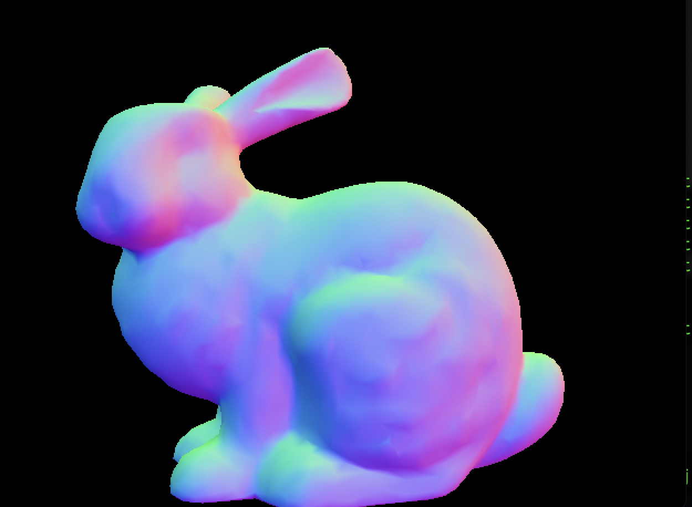
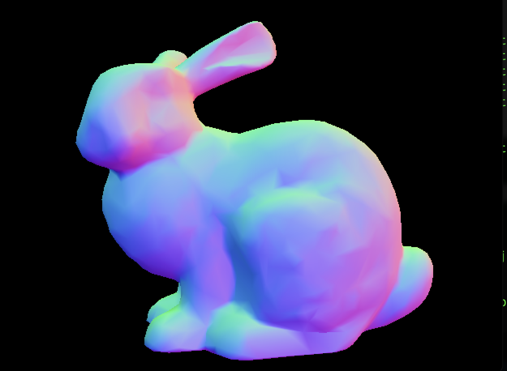
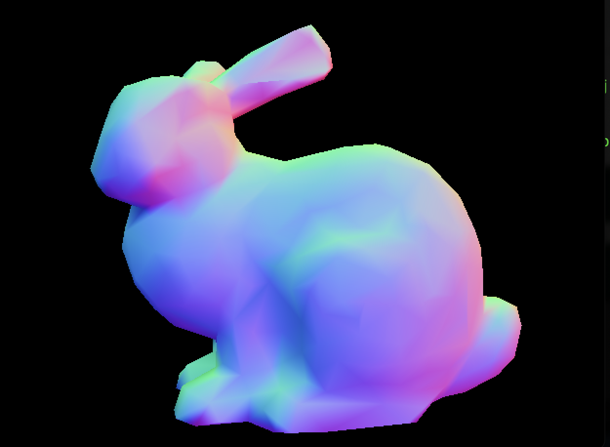
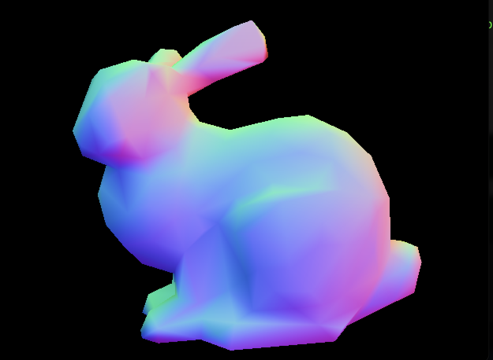
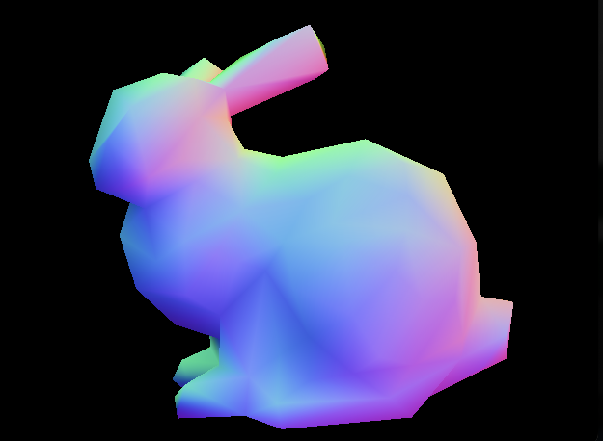

## Progressive Mesh Implementation Based on Hoppe's Paper

### Overview:
This project replicates the approach introduced by Hugues Hoppe in his 1996 paper, "Progressive Meshes," which provides a scheme for representing detailed geometric models in a progressively refined manner.

### Key Features:
- **Vertex Splitting & Collapsing**: Introduced a mechanism to iteratively split or collapse vertex pairs, allowing the mesh to be refined or simplified on-the-fly.
- **Quadric Error Metrics**: Integrated quadric error metrics to guide the vertex pair collapses, ensuring the visual fidelity of the model remains consistent even when reduced to fewer vertices.

### Outcomes:
Successfully rendered large geometric models with real-time zoom and detail adjustments, showcasing the efficacy of the progressive mesh approach in handling detailed 3D models with varying resolutions.

### Images:

*Original Image - active faces: 4968*

*After 10 steps - active faces: 2974*

*After 20 steps - active faces: 1780*

*After 30 steps - active faces: 1066*

*After 30 steps - active faces: 638*

*After 30 steps - active faces: 382*

### Credits:
- The build script was created by Prof. Mike Shah which he provided as part of our coursework in Computer Graphics